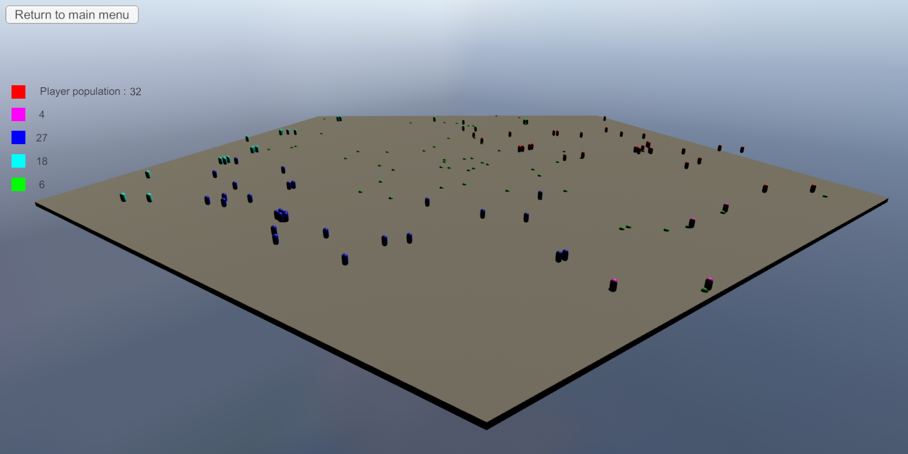

# Population

> Concept of a strategic game revolving around the choice of statistics of a population

---
This repository includes: 
- menu to choose the arena and population stats
- populations growth and behaviour
- winning and losing conditions (win if the player's population has the highest number of individuals)

The goal of this repository is to show an idea of gameplay and an example UI and AI programming